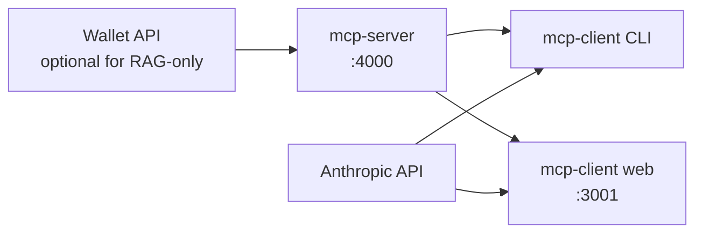

# Getting started — running the apps

This guide explains how to install dependencies, configure environment variables, and start each application in the MCP-demo monorepo.

## Applications

| App | Package | Default port | Purpose |
| --- | --- | --- | --- |
| **mcp-server** | `@mcp-demo/mcp-server` | `4000` | NestJS MCP server — exposes Wallet API tools and RAG search over HTTP |
| **mcp-client** (CLI) | `@mcp-demo/mcp-client` | — | Interactive terminal chat with Claude and MCP tool support |
| **mcp-client** (web) | `@mcp-demo/mcp-client` | `3001` | Browser chat UI (React + Express) with the same MCP integration |

The client apps connect to the MCP server over streamable HTTP. Start **mcp-server** first, then either client.

## Prerequisites

- [Node.js](https://nodejs.org/) 18+ (22 recommended)
- npm 9+
- **mcp-server:** a running [MindShaker Wallet API](http://localhost:3000/docs) when using Wallet-related tools (payments, wallets, exchange rates)
- **mcp-client:** an [Anthropic API key](https://console.anthropic.com/)
- **RAG (`search_knowledge_base`):** a [Voyage AI](https://docs.voyageai.com/) API key and an ingested knowledge index — see [rag-knowledge-base.md](rag-knowledge-base.md)

## One-time setup

From the repository root:

```bash
npm install
```

Copy and edit environment files:

```bash
cp apps/mcp-server/.env.template apps/mcp-server/.env
cp apps/mcp-client/.env.template apps/mcp-client/.env
```

### mcp-server (`apps/mcp-server/.env`)

| Variable | Required | Description |
| --- | --- | --- |
| `PORT` | No | Server port (default `4000`) |
| `MCP_SERVER_API_KEY` | Yes | API key clients must send (`x-api-key` or `Authorization: Bearer`) |
| `WALLET_API_BASE_URL` | No | Upstream Wallet API URL (default `http://localhost:3000`) |
| `WALLET_API_KEY` | Yes* | Sent as `x-wallet-api-key` when tools call the Wallet API |
| `VOYAGE_API_KEY` | Yes** | Required for the `search_knowledge_base` RAG tool |
| `VOYAGE_EMBED_MODEL` | No | Embedding model (default `voyage-3.5`) |
| `LANCEDB_PATH` | No | Vector store directory (default `data/lancedb`) |
| `LANCEDB_TABLE` | No | LanceDB table name (default `knowledge`) |

\* Required for Wallet tool calls.  
\** Required only if you use RAG; run ingestion after configuring — see [rag-knowledge-base.md](rag-knowledge-base.md).

### mcp-client (`apps/mcp-client/.env`)

| Variable | Required | Description |
| --- | --- | --- |
| `ANTHROPIC_API_KEY` | Yes | Anthropic API key |
| `MCP_SERVER_URL` | No | MCP endpoint (default `http://127.0.0.1:4000/mcp/v1`) |
| `MCP_SERVER_API_KEY` | Yes | Must match `MCP_SERVER_API_KEY` on the MCP server |
| `CLAUDE_MODEL` | No | Claude model (default `claude-sonnet-5`) |
| `CLAUDE_MAX_TOKENS` | No | Max output tokens (default `4096`) |
| `CLAUDE_THINKING_BUDGET` | No | Extended-thinking budget in tokens; set `0` to disable |
| `CLIENT_WEB_PORT` | No | Web UI port (default `3001`) |
| `CLIENT_WEB_USERNAME` | Web only | HTTP Basic Auth username |
| `CLIENT_WEB_PASSWORD` | Web only | HTTP Basic Auth password |

`MCP_SERVER_API_KEY` on the client must match the value on the server or MCP tool calls will fail.

## Quick start (local development)

Use two terminals from the repository root.

**Terminal 1 — MCP server (with hot reload):**

```bash
npm run start:server:dev
```

When ready, you should see:

```
MCP server is running on port 4000
MCP endpoint: POST http://localhost:4000/mcp/v1
```

**Terminal 2 — CLI client or web client** (pick one):

```bash
# Interactive terminal chat
npm run start:client
```

```bash
# Browser chat UI (dev mode with Vite HMR)
npm run start:client:web
```

Open the web UI at [http://localhost:3001](http://localhost:3001) (or your `CLIENT_WEB_PORT`). The browser will prompt for the Basic Auth credentials from `.env`.

## Scripts reference

Scripts like `start:server` and `start:client` are defined in the **repository root** `package.json`. They do not exist inside `apps/mcp-server` or `apps/mcp-client`.

| Where you are | Start MCP server | Start MCP server (hot reload) |
| --- | --- | --- |
| Repository root (`MCP-demo/`) | `npm run start:server` | `npm run start:server:dev` |
| Inside `apps/mcp-server/` | `npm run start` | `npm run start:dev` |

Running `npm run start:server` from `apps/mcp-server/` fails with `Missing script: "start:server"` — use `npm run start` or `npm run start:dev` there instead, or `cd` to the repo root first.

### MCP server

From the **repository root**:

| Command | Description |
| --- | --- |
| `npm run start:server:dev` | Start with hot reload (recommended for development) |
| `npm run start:server` | Start once (no watch) |
| `npm run ingest:knowledge -w @mcp-demo/mcp-server` | Build and ingest documents into the RAG index |

From **`apps/mcp-server/`**:

| Command | Description |
| --- | --- |
| `npm run start:dev` | Start with hot reload |
| `npm run start` | Start once (no watch) |
| `npm run ingest:knowledge` | Build and ingest documents into the RAG index |

### MCP client

From the **repository root**:

| Command | Description |
| --- | --- |
| `npm run start:client` | CLI chat in the terminal |
| `npm run start:client:web` | Web UI in development mode (Vite middleware) |
| `npm run start:client:web:prod` | Web UI serving a pre-built static bundle |
| `npm run build:client:web` | Build the React UI to `apps/mcp-client/web/dist/` |

From **`apps/mcp-client/`**:

| Command | Description |
| --- | --- |
| `npm run start` | CLI chat in the terminal |
| `npm run start:web` | Web UI in development mode |
| `npm run start:web:prod` | Web UI serving a pre-built static bundle |
| `npm run build:web` | Build the React UI |

### Monorepo

| Command | Description |
| --- | --- |
| `npm run build` | Build all workspaces |
| `npm run lint` | Lint TypeScript |
| `npm run format` | Format with Prettier |

## Startup order and dependencies



1. **Wallet API** — only needed when exercising payment, wallet, or exchange-rate tools.
2. **mcp-server** — must be running before starting a client.
3. **mcp-client** — connects to Anthropic and the MCP server; it can start without MCP (tools disabled) if the server is unreachable, but tool use requires a healthy server.

For RAG, ingest knowledge **after** the server `.env` is configured:

```bash
npm run ingest:knowledge -w @mcp-demo/mcp-server
```

Then restart or keep the server running — the vector store is read from disk.

## Production-style web client

To run the web client with a built frontend (no Vite dev server):

```bash
npm run build:client:web
npm run start:client:web:prod
```

For server deployment (PM2, nginx, staging), see [deploy/DEPLOY.md](deploy/DEPLOY.md).

## Verify the stack

| Check | How |
| --- | --- |
| MCP server health | Server logs `Nest application successfully started` and the MCP endpoint URL |
| MCP endpoint | Follow [testing-mcp-endpoint.md](testing-mcp-endpoint.md) |
| Web API health | `GET http://localhost:3001/api/health` (with Basic Auth) |
| Claude Desktop | See [claude-desktop.md](claude-desktop.md) |

## Troubleshooting

**Client says MCP is not connected or has no tools**

- Confirm mcp-server is running on the port in `MCP_SERVER_URL`.
- Confirm `MCP_SERVER_API_KEY` matches on both server and client.
- Check firewall / binding: default URL is `http://127.0.0.1:4000/mcp/v1`.

**Wallet tool calls fail**

- Ensure the Wallet API is up at `WALLET_API_BASE_URL`.
- Verify `WALLET_API_KEY` in `apps/mcp-server/.env`.

**Web client exits on start**

- `CLIENT_WEB_USERNAME` and `CLIENT_WEB_PASSWORD` are required for the web server.
- `ANTHROPIC_API_KEY` is required for chat.

**`search_knowledge_base` returns errors**

- Set `VOYAGE_API_KEY` and run ingestion — see [rag-knowledge-base.md](rag-knowledge-base.md).

**Port already in use**

- Change `PORT` (server) or `CLIENT_WEB_PORT` (web client) in the respective `.env` file.

## Related docs

- [testing-mcp-endpoint.md](testing-mcp-endpoint.md) — curl examples for the MCP HTTP API
- [claude-desktop.md](claude-desktop.md) — connect Claude Desktop to the MCP server
- [rag-knowledge-base.md](rag-knowledge-base.md) — RAG setup and ingestion
- [deploy/DEPLOY.md](deploy/DEPLOY.md) — build and deploy to Ubuntu with PM2
